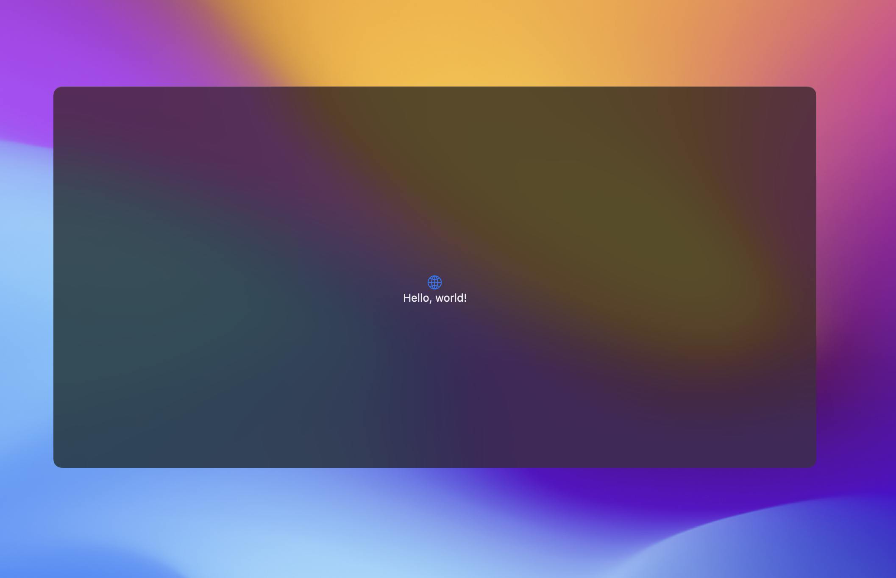

# TranslucentWindowStyle

Translucent Window Background Style is a Swift package with a custom SwiftUI window background style that creates a translucent window with a blur effect. This package allows you to add a translucent background style to your SwiftUI app's windows.

## Overview

The Translucent Window Background Style package provides a `TranslucentBackgroundStyle` struct that conforms to the `WindowBackgroundStyle` protocol. This style creates a translucent window with a blur effect.

## Usage

To use the Translucent Window Background Style in your SwiftUI app, follow these steps:

1. Import the package in your SwiftUI view file:

   ```swift
   import TranslucentWindowBackgroundStyle
   ```

2. Apply the `presentedWindowBackgroundStyle` modifier to your window view, and pass in an instance of `TranslucentBackgroundStyle`:

   ```swift
   WindowGroup {
       ContentView()
          .presentedWindowBackgroundStyle(.hiddenTitleBarTranslucent)
   }
   ```

3. The `hiddenTitleBarTranslucent` static property of `TranslucentBackgroundStyle` provides a convenient method to create a translucent window without a title bar.

   ```swift
   TranslucentBackgroundStyle.hiddenTitleBarTranslucent
   ```

### Example



## Installation

The Translucent Window Background Style package can be installed via Swift Package Manager. To install, follow these steps:

1. Open your project in Xcode.

2. Click on File > Swift Packages > Add Package Dependency.

3. Enter the following URL in the search bar:

   ```javascript
   https://github.com/DominatorVbN/TranslucentWindowBackgroundStyle
   ```

   Replace "your-username" with your GitHub username or the URL of your forked repository if you want to used the foked version in your app.

4. Choose the version or branch of the package that you want to install.

5. Click on the Add Package button.

6. Add `TranslucentWindowBackgroundStyle` to the list of dependencies for your target in your project's `Package.swift` file:

   ```swift
   dependencies: [
       .package(url: "https://github.com/DominatorVbN/TranslucentWindowBackgroundStyle", .upToNextMinor(from: "1.0.0"))
   ]
   ```

   Replace "your-username" with your GitHub username or the URL of your forked repository if you want to used the foked version in your app., and "1.0.0" with the version or branch that you installed.

7. Import the package in your SwiftUI view file:

   ```swift
   import TranslucentWindowBackgroundStyle
   ```

8. You're now ready to use the Translucent Window Background Style in your SwiftUI app!

## Contributing

Contributions are always welcome, whether it's bug fixes, feature enhancements, or documentation improvements. To contribute, please follow these steps:

1. Fork the repository
2. Create a new branch for your changes: `git checkout -b feature/your-feature-name`
3. Make your changes and commit them: `git commit -m 'Add some feature'`
4. Push your changes to your forked repository: `git push origin feature/your-feature-name`
5. Create a pull request on the original repository, with a description of your changes

Thank you for your contributions!
